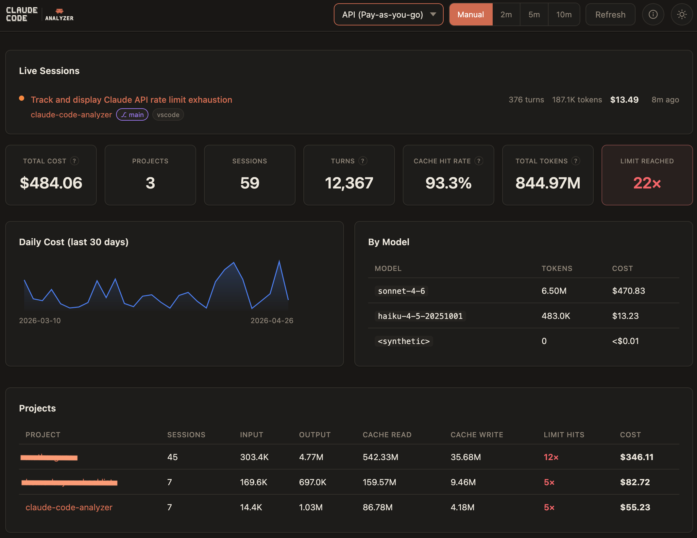
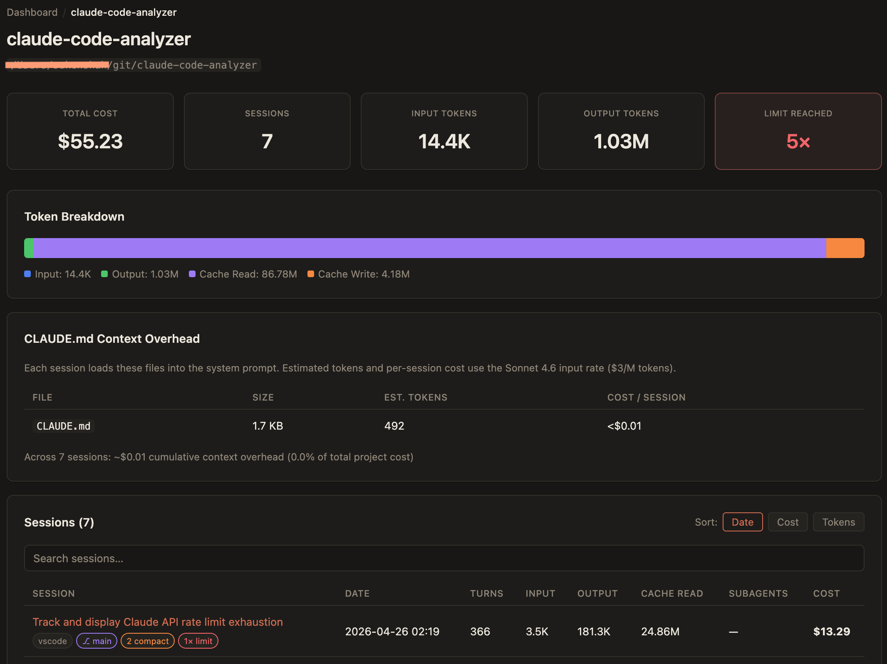
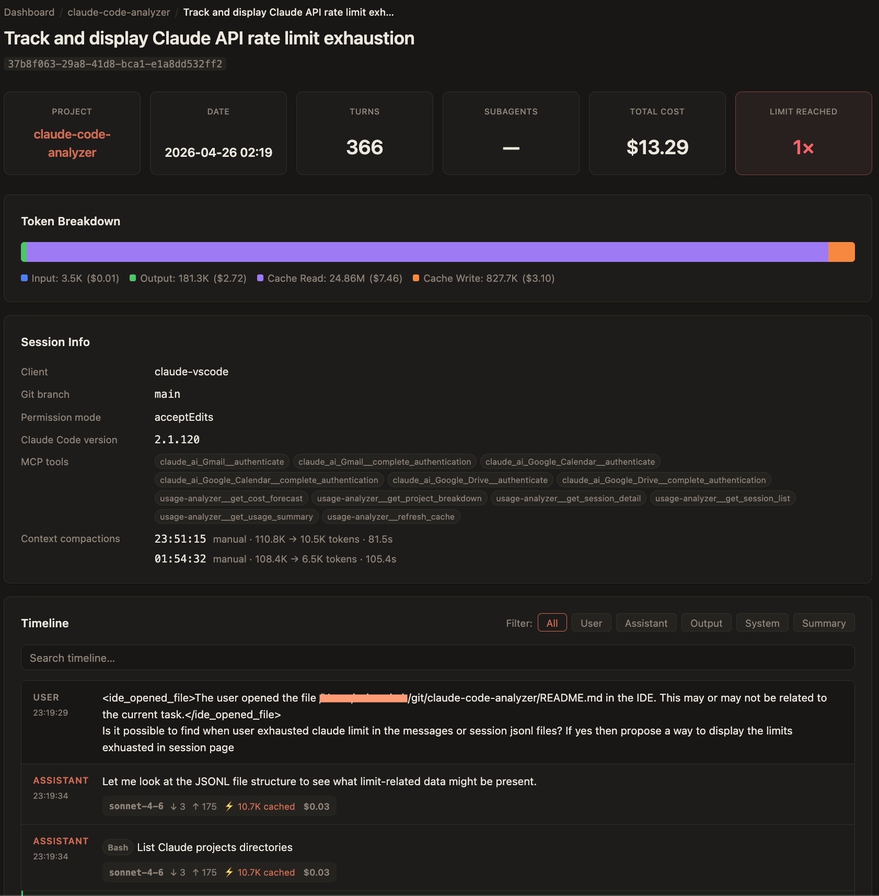
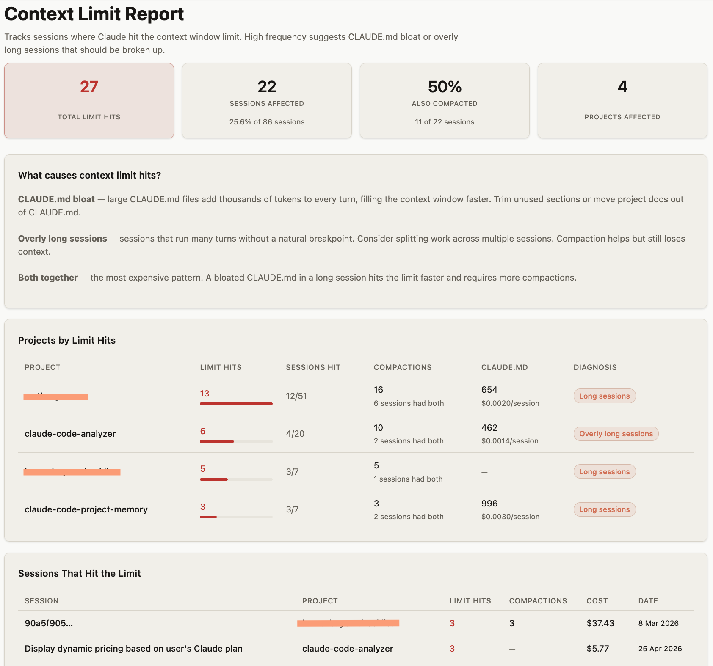
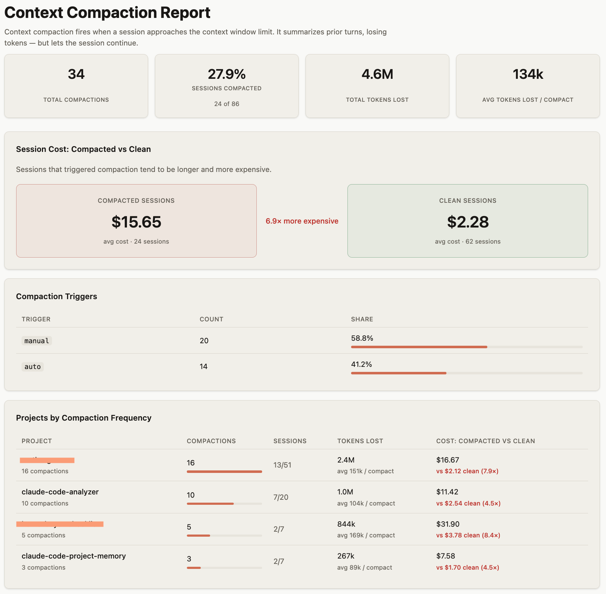
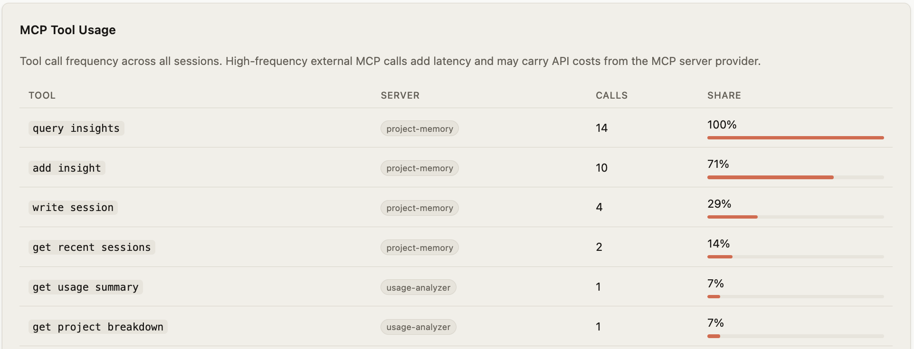
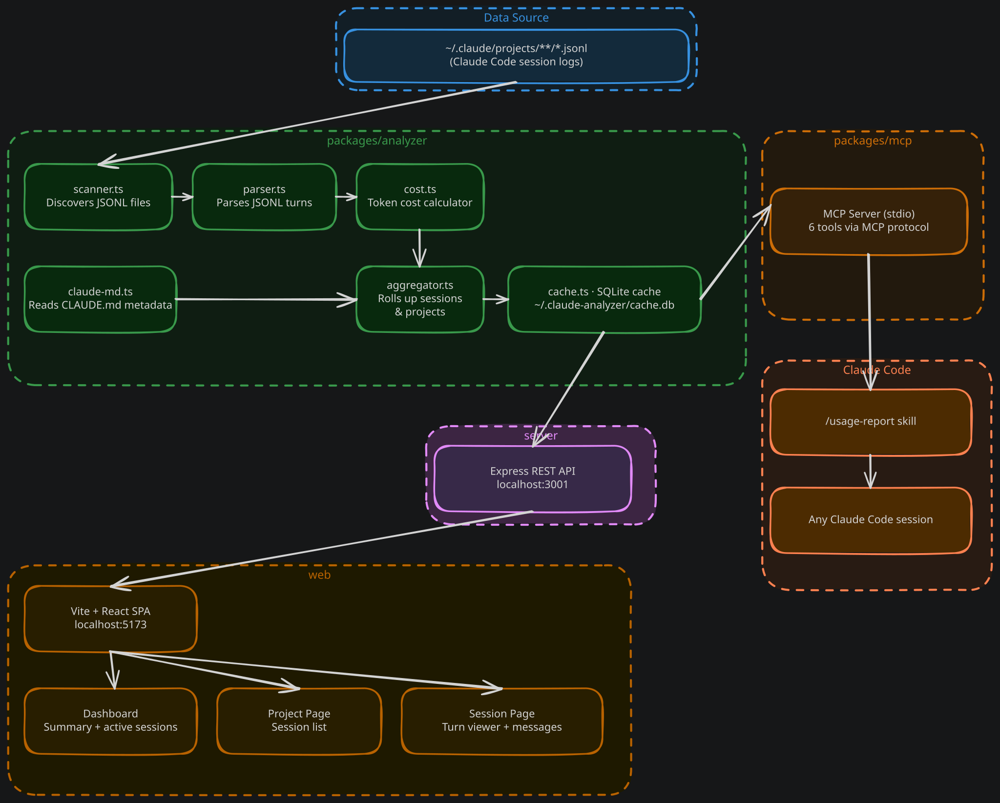

# Claude Code: Analyzer

A local web app that parses Claude Code JSONL session logs to show token usage and cost broken down by session, turn, and project.


## Overview

### Motivation

Claude Code is a powerful AI coding assistant, but it gives you little built-in visibility into how much you're spending or which projects and sessions are consuming the most tokens during development. If you use Claude Code heavily across multiple projects especially with long agentic sessions, subagents, and tool calls, costs can accumulate quickly and opaquely.

Claude Code Analyzer was built to bring useful insights hidden into claude's local project and session files in user friendly console. The goal is to give developers a clear, honest picture of their Claude Code usage: what it costs, where the tokens are going, and how efficiently the prompt cache is working, without sending any data anywhere outside your workstation.

### Benefits

- **Understand your spend** — see total cost broken down by project, session, and individual turn so you know exactly where your budget is going.
- **Identify expensive sessions** — quickly surface sessions with high token counts, repeated limit hits, or poor cache efficiency.
- **Track trends over time** — daily cost charts and forecasting help you spot usage spikes before they become bill surprises.
- **Optimize caching** — cache hit rate stats show how effectively Anthropic's prompt cache is reducing your input costs.
- **Debug sessions** — the full message timeline with tool calls, command outputs, hook results, and system events lets you replay exactly what happened in any session.
- **Query from within Claude** — the built-in MCP server lets you ask Claude Code itself for a cost summary without leaving your terminal.

### Local-only and private by design

**Your session data never leaves your machine.** Claude Code Analyzer reads JSONL log files directly from `~/.claude/projects/` on your local filesystem. The Next.js app runs entirely locally — there are no cloud services, no telemetry, no accounts, and no network requests to any external server.

This means:

- **Works offline** — fully functional without an internet connection. Once installed, no network access is required.
- **No data sharing** — your prompts, code, tool outputs, and cost data stay on your machine.
- **No authentication** — nothing to sign up for or log into.
- **Auditable** — all parsing and cost calculation logic is open source and runs locally in your Node.js process.

## Screenshots

**Dashboard** — project overview with cost breakdown and forecasting



**Project** — session list with token usage and cache efficiency



**Session** — full message timeline with tool calls and per-turn cost



## Features

- Per-project and per-session token usage with cost breakdown
- Turn-level message viewer with tool calls, hook results, and system caveats
- Cache efficiency stats (cache read vs. write tokens)
- Cost forecasting (weekly / monthly projection)
- Active session monitor showing currently running Claude Code sessions
- MCP server for querying usage data directly from any Claude Code session
- `/usage-report` skill for a one-command cost summary

### Context Limit Report

Surfaces which projects and sessions hit Claude's context window limit most often. Useful for identifying workflows that routinely exhaust the context window — a signal to break sessions up, use compaction, or restructure prompts. Shows per-project and per-session limit hit counts with direct links to the offending sessions.



### Compaction Report

Shows where Claude Code's automatic context compaction is firing and what it costs you. Tracks total compaction events per project, average tokens lost per compaction, and compares the cost of compacted vs. clean sessions side-by-side. Helps you decide whether compaction is saving money or whether sessions are just too long.



### Auto Memory per project

Each project page now shows the contents of Claude Code's auto memory for that project (`~/.claude/projects/<key>/memory/MEMORY.md`). Auto memory is the set of notes Claude writes itself across sessions — build commands, debugging insights, architecture notes, and preferences it discovers. Surfacing it here lets you audit what Claude has learned and spot entries that may be outdated or incorrect.

### MCP Tool Usage per project

Each project page includes a breakdown of MCP tool calls made across all sessions. Shows tool name, which MCP server it belongs to, total call count, and relative share. Useful for identifying high-frequency external tool calls that add latency or carry third-party API costs.



## Architecture


[Edit architecture diagram](docs/architecture.excalidraw) — open with [Excalidraw](https://excalidraw.com) (File → Open) or the VS Code Excalidraw extension.

### Package overview

| Package | Description |
|---|---|
| `packages/analyzer` | Core library: scans `~/.claude/projects/`, parses JSONL, computes costs, caches results in SQLite |
| `packages/mcp` | MCP server exposing 6 query tools over stdio transport |
| `next-app` | Next.js app (port 3000) — API route handlers + React UI (dashboard, project, and session views) |

### Data flow

1. **Scan** — `scanner.ts` walks `~/.claude/projects/` and returns all `.jsonl` file paths with their project key and session ID.
2. **Cache check** — `cache.ts` skips files whose `mtime` and `size` haven't changed since last parse.
3. **Parse** — `parser.ts` reads each JSONL line, extracts `usage` blocks from assistant turns, and records token counts per model.
4. **Cost** — `cost.ts` maps model names to per-token prices and computes a dollar cost for each turn.
5. **Aggregate** — `aggregator.ts` groups turns into sessions and projects, computing totals and metadata.
6. **Serve** — Next.js route handlers load the aggregated result on first request (held in an in-memory singleton) and expose REST endpoints under `/api/*`; the React client components fetch from these endpoints.

## Requirements

- Node.js 18+
- Claude Code installed with sessions in `~/.claude/projects/`

## Getting started

```bash
# Clone and install
git clone https://github.com/your-username/claude-code-analyzer.git
cd claude-code-analyzer
npm install

# Build all packages
npm run build

# Start the app (single command)
npm run dev
# → http://localhost:3737
```

## MCP server (Claude Code — stdio)

The analyzer exposes an MCP server for querying usage data from within any Claude Code session.

### In this project

Copy `.mcp.json.example` to `.mcp.json` and replace `<REPO_PATH>` with the absolute path to this repo:

```bash
cp .mcp.json.example .mcp.json
# Edit .mcp.json and set the correct path
```

### From another project

Add to that project's `.mcp.json`:

```json
{
  "mcpServers": {
    "usage-analyzer": {
      "command": "node",
      "args": ["/absolute/path/to/claude-code-analyzer/packages/mcp/dist/index.js"]
    }
  }
}
```

### Sample prompts (Claude Code)

Ask these in any Claude Code session with the MCP configured:

```
How much have I spent on Claude Code this week?
```
```
Show me my most expensive projects over the last 30 days.
```
```
Which session cost the most yesterday? Break down its token usage.
```
```
What's my projected monthly Claude Code bill at my current usage rate?
```
```
How efficient is my prompt cache? Show cache hit rate by project.
```

### Available MCP tools

| Tool | Description |
|---|---|
| `get_usage_summary` | Total tokens + cost, filterable by project and days |
| `get_project_breakdown` | All projects ranked by cost / tokens / sessions |
| `get_session_list` | Sessions for a project |
| `get_session_detail` | Per-turn breakdown for a session |
| `get_cost_forecast` | Projected weekly / monthly cost |
| `refresh_cache` | Re-scan JSONL files |

## `/usage-report` skill

Once the MCP server is configured, invoke `/usage-report` in any Claude Code session to get a formatted cost summary for the current project.

## Cache

Parsed data is cached at `~/.claude-analyzer/cache.db` (SQLite). Only files whose `mtime` or `size` has changed are re-parsed on subsequent runs. Use the **Refresh** button in the UI (or `POST /api/refresh`) to force a full re-scan.

## License

[MIT](LICENSE)
